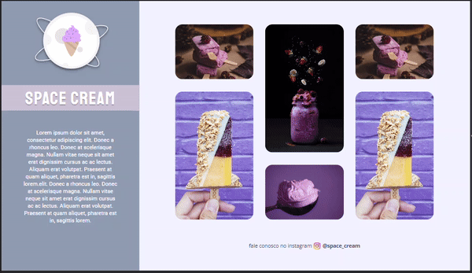

<h1 align="center">

Space Cream

</h1>

## 🚀 Tecnologias

Esse projeto foi desenvolvido com as seguintes tecnologias:

- HTML
- CSS

## 💻 Projeto

Inicialmente o SpaceCream é um desafio com a ideia de criar um projeto levando em consideração o Mobile First, aplicando unidade de medida flexivel, variáveis e animações simples. Em sequência na segunda parte do desafio era criar um footer para versão Desktop e usar Grid, Media Queries, Animações e Trasições. 

- [Acesse o projeto finalizado, online](https://lreiss7.github.io/spacecream)

## 🔖 Layout

Você pode visualizar o layout do projeto através dos links:

- [Mobile First](https://www.figma.com/file/6UPKA8YSWSx9h4DGRhmW4r/Stage-03-Mobile-First-Copy?fuid=1218621270711100994) 📱

- [Desktop](<https://www.figma.com/file/BQafngxXS8JxpPlBc85Oka/Stage-03---Grid-com-anima%C3%A7%C3%B5es-(Copy)?type=design&node-id=0-1&t=aQiv7f9yrKaXaacC-0>) 🖥️

É necessário ter conta no [Figma](https://figma.com) para acessá-lo.

## 💪Desafio feito por

                      | Luan Reis | 🙅‍♂️

- [LinkDin](https://www.linkedin.com/in/lreiss7)
- [GitHub](https://github.com/lreiss7)
---
